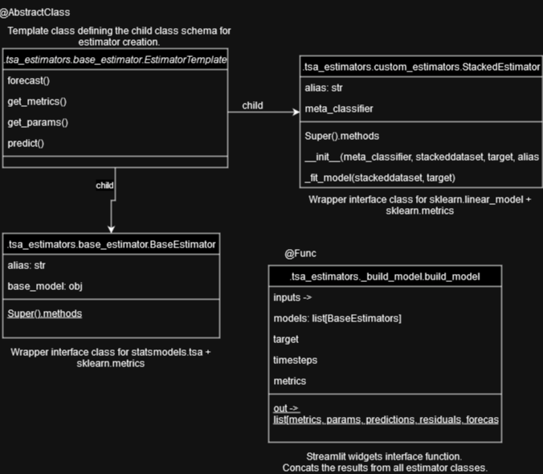

# [Forecasting App](https://link-url-here.org) using univariate TSA models

Sandbox project to dynamically test custom time series forecasting models in a small business dataset using statsmodels, sklearn and streamlit.

## Table of Contents

- [Table of Contents](#table-of-contents)
- [Introduction](#introduction)
- [Features](#features)
- [Getting Started](#getting-started)
  - [Prerequisites](#prerequisites)
  - [Installation](#installation)
- [Deployment](#deployment)

## Introduction

Project is divided in streamlit components in *st_components* folder and estimators components in *tsa_estimators* folder.

### File structure
```
project/
│
├── st_components/
│   ├── charts.py
│   ├── selectbox.py
│
├── tsa_estimators/
│   ├── _build_model.py_
│   ├── custom_estimators.py_
│   └── base_estimator.py
│
├── _streamlit_app.py
├── utils.py
├── requirements.txt
└── README.md
```
### Design for dynamical models



*tsa_estimators* folder defines the main classes for this project. Since the purpose was early on established as evaluating different models using the same metrics and functions, an abstract class was created as template and each estimator class was then derived from this class. 
\
This provides a base line to dynamically add new models and to compare such models using 
\
The *build_model* function is used to concat the results from every model and return a list of dataframes which provides a very good interface for streamlit.
```
  +------+        +------+          +------+
|BaseModel|     |BaseModel|        |BaseModel|
  +------+        +------+          +------+
       \          /               /
        \        /           /
         +------+       /
       build_models /
         +------+
              \
               \
                \
                +------+
                 Output
                +------+
```
### Scope of the project

- Compare the results of different TSA models
- Provide a custom sandbox framework
    - Create custom TSA models
    - Add your own model params and aliases
    - Define the metrics you want (full support to sklearn regressor metrics)
    - Define stacking regression models using TSA as base models
- Residuals plot for normality check
- Forecasting and model params

### Not in scope

- Optimization of model params (such as GridSearchCV)
- Normal tests for residuals (such as Shapiro Wilk)
- Homoscedasticity tests for residuals
- Extensive user interface to add and customize models outside of python script
- Standard errors of each model (it would make the UI cluttered) but you can easily implement it via implementation of BaseEstimator.get_stderr method

## Features

### Custom model constructor

Supporting all statsmodels.tsa models as well as others:
- Holt
- Holt Winters
- SimpleExpSmoothing
- ARMA
- ARIMA

### Stacking model constructor with TSA as base models

Supports any sklearn.linear_model class:
- ElasticNet
- Ridge
- Lasso
- LinearRegression
- more to confirm (in theory all should be supported)

## Getting Started

#### Passing models constructor object list

Each model should be passed as a *list [model_object: statsmodels.tsa, alias]*. If no model alias is given, consider an empty string.

``` Python
# models: list[[model_object: statsmodels.tsa, alias: str]]
__models = [[SimpleExpSmoothing(endog = target, 
                                initialization_method="estimated"),
                                ""],
            [Holt(endog = target,
                    initialization_method = "estimated", 
                    exponential = True),
                    "Holt-model"],
            [ExponentialSmoothing(endog = target, 
                                    seasonal_periods=12, 
                                    trend="add", 
                                    seasonal="add", 
                                    use_boxcox=False, 
                                    initialization_method="estimated"),
                                    "HW-Additive"],
            [ExponentialSmoothing(endog = target, 
                                    seasonal_periods=12, 
                                    trend="add", 
                                    seasonal="mul", 
                                    use_boxcox=False, 
                                    initialization_method="estimated"),
                                    "HW-Multiplicative"],
            [ExponentialSmoothing(endog = target, 
                                    seasonal_periods=12, 
                                    trend="add", 
                                    seasonal="add", 
                                    use_boxcox=False,
                                    damped_trend = True,
                                    initialization_method="estimated"),
                                    "HW-Additive-damped-trend"],
            [ExponentialSmoothing(endog = target, 
                                    seasonal_periods=12, 
                                    trend="add", 
                                    seasonal="mul", 
                                    use_boxcox=False,
                                    damped_trend = True,
                                    initialization_method="estimated"),
                                    "HW-Multiplicative-damped-trend"]] 
```

#### Using stacked models

Stacked models can't be dynamically implemented, but this is how they work.

``` Python
# stacking estimator
se = StackedEstimator(meta_classifier = LinearRegression(),
                    stackeddataset = _pred,
                    target = target,
                    alias = "Stacking estimator (LR)"
                    )
```

*meta_classifier* receives an instance of the meta classifier class ([see supported classifiers](#Passing models constructor object list)), *stackeddataset* param receives the predictions dataframe from all the base estimators and *target* references the target variable.

### Prerequisites

The project was built on Python 3.10.6.

### Installation

```bash
# Example installation commands
git clone https://github.com/yourusername/yourproject.git
cd yourproject
pip install -r requirements.txt
run in console: streamlit run _streamlit_app.py
```
## Deployment

The project was deployed using streamlit native serverless. 
